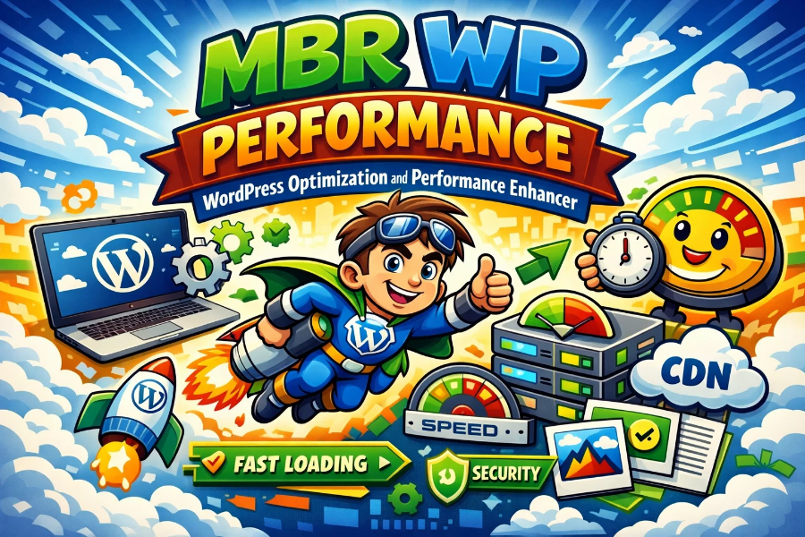
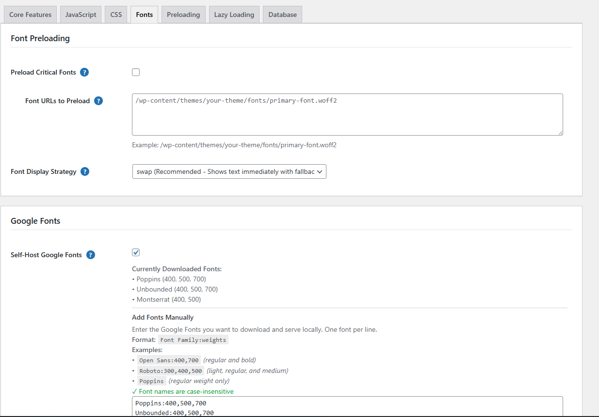
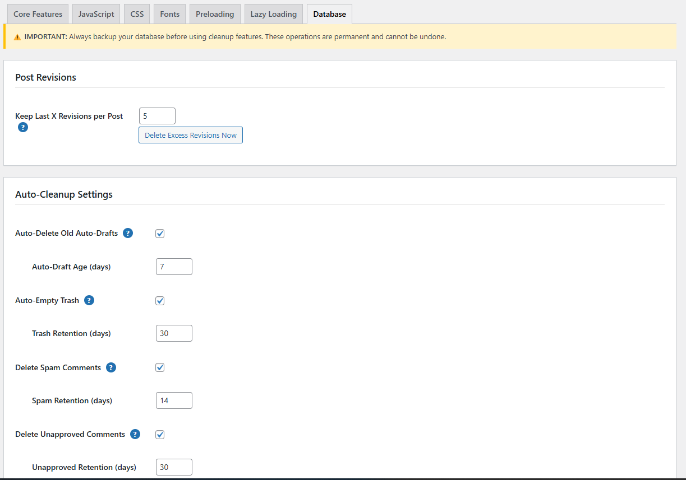
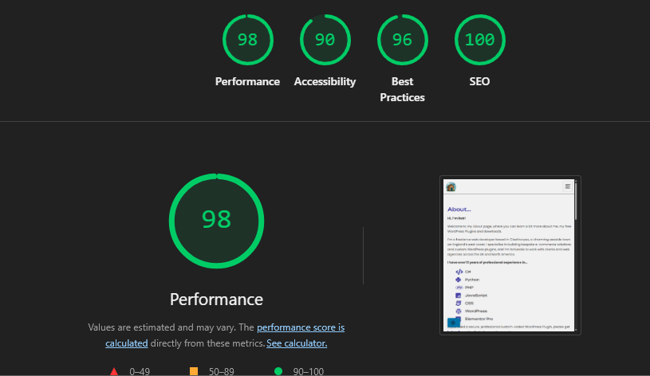

# MBR WP Performance

> The most comprehensive WordPress performance optimization plugin. Control every aspect of your site's speed with granular, transparent controls.

[**Download Latest Release**](https://github.com/harbourbob/mbr-wp-performance/releases) | [**Documentation**](docs/user-guide.md) | [**Report Bug**](https://github.com/harbourbob/mbr-wp-performance/issues) | [**Request Feature**](https://github.com/harbourbob/mbr-wp-performance/issues)

## ⚡ Features

- 🚀 **JavaScript Optimization**: Defer, async, combine, delay execution
- 🎨 **CSS Optimization**: Critical CSS, minification, unused CSS removal
- 🔤 **Font Management**: Self-host Google Fonts, preloading, subsetting
- 🖼️ **Smart Loading**: Lazy load images/videos, preload critical resources
- 🗄️ **Database Cleanup**: Remove bloat, optimize tables, scheduled maintenance
- 🎯 **Granular Control**: Enable/disable individual optimizations

## 📸 Screenshots

| Fonts Tab | Database Optimization | Performance Results |
|-----------|----------------------|---------------------|
|  |  |  |

## 🚀 Quick Start

1. Download the [latest release](https://github.com/harbourbob/mbr-wp-performance/releases)
2. Upload to `/wp-content/plugins/`
3. Activate via WordPress admin
4. Click "WP Performance" in the admin toolbar
5. Start with Database cleanup and Lazy Loading

## 📊 Real Results

Before: 4.2s load, 3.1 MB, 87 requests
After:  1.8s load, 1.2 MB, 42 requests
Result: 57% faster, 61% smaller

## 🎯 Why Choose This Plugin?

Unlike bloated all-in-one solutions:

✅ **Transparent**: Every optimization clearly explained
✅ **Granular**: Control individual features, not presets
✅ **Safe**: Compatible with page builders, no vendor lock-in
✅ **Free**: 100% free, no premium upsells
✅ **Private**: No phone-home, no tracking
✅ **Developer-Friendly**: Clean code, hooks, filters

## 📚 Documentation

- [**Complete User Guide**](docs/user-guide.md) - Everything you need to know
- [Installation Guide](docs/installation.md)
- [Troubleshooting](docs/troubleshooting.md)
- [FAQ](docs/faq.md)
- [Developer Hooks](docs/developer-hooks.md)

## 🛠️ Requirements

- WordPress 5.8 or higher
- PHP 7.4 or higher
- MySQL 5.6 or higher

## 🤝 Contributing

Contributions are welcome! See [CONTRIBUTING.md](CONTRIBUTING.md) for guidelines.

## 📝 License

GPL v2 or later - See [LICENSE](LICENSE)

## 🙏 Support

- [Documentation](docs/user-guide.md)
- [Issue Tracker](https://github.com/harbourbob/mbr-wp-performance/issues)
- [Discussions](https://github.com/harbourbob/mbr-wp-performance/discussions)

## 🌟 Star History

If you find this useful, please star the repo! It helps others discover it.

---

**Made with ❤️ by [Made by Robert](https://madebyrobert.co.uk)**
